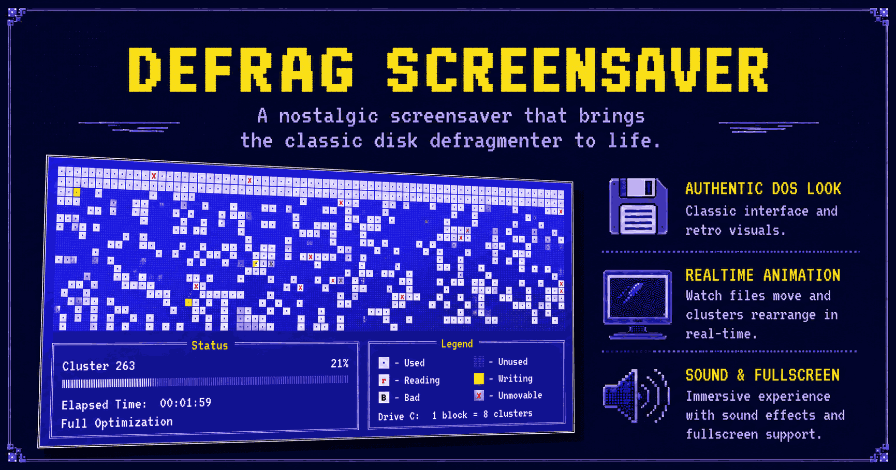

# Defrag Screensaver



### Watch it Live on Your Browser: [Here](https://saneeshnp.github.io/defrag-screensaver/)

Remember staring at the screen for hours, watching little blocks shuffle from one place to another, hypnotized by the rhythm of it all? That was Defrag. The most mesmerizing utility Microsoft ever shipped, pretending to do something important so you could call it productivity.

This is a tiny web tribute to that screen. Pick your flavor of old Windows, hit Start, and let the clusters slide around like it's 1996 again. No drives are being defragmented. Nothing is actually optimizing. It just looks like it is, and honestly that was always the best part.

## Try it

Visit [saneeshnp.github.io/defrag-screensaver](https://saneeshnp.github.io/defrag-screensaver/), or open `index.html` locally in any modern browser.

## The vibes on offer

- **MS-DOS 6.22** for the purists. Pale blue background, white blocks, yellow flashes, the whole deal.
- **MS-DOS 6.22 but dark** for the night owls. Same DOS energy, pure black background.
- **Windows 3.1** if you remember Program Manager fondly.
- **Windows 95 / 98** for the era of beige towers and the startup chime.
- **Windows XP** if you want the friendlier blue and red bar version that came later.

Pick a duration (5, 10, 30 minutes, or run it until the disk is fully consolidated), choose a sound mode, and decide if you want it to take over your whole screen. Press Escape to come back to reality.

## Sound options

- **IBM 90's hard disk** (default). Looped recording of an actual chunky 90s HDD doing its thing. Decoded with Web Audio API so the loop is genuinely seamless, no MP3 stutter at the join.
- **8-bit beeps**. Squarewave PC speaker ticks on every move and flash. Synthesized via WebAudio.
- **No sound**. Silent run, including the ending chime.

## How it pretends to work

A grid of clusters gets randomly scattered. One slot at the top picks a random used block from somewhere else on the disk, flashes `r` and `W` a few times like it's reading and writing, then settles into place. Occasionally a move takes a little longer, like it hit a stubborn file. Scattered cells flicker in the background, just for fun.

If you picked a fixed duration, the disk lightly re-fragments and keeps going until the timer runs out. If you picked "Until defrag completes", it stops when every block has been consolidated and shows a little OPTIMIZATION COMPLETE popup on top of the finished screen.

The Windows XP version is the same idea but with the horizontal colored bars instead of the cluster grid.

## Why does this exist

Because sometimes you want a moment of pixelated nostalgia. Because watching progress bars is a lost art. Because that one screen, more than any other, defined what a PC felt like in the 90s.

Also because GitHub Pages is free and hosting a screensaver in 2026 is funny.

## Hosting it yourself

The whole thing is static: `index.html`, `styles.css`, `script.js`, `hdd-defrag-audio.mp3`, and `og-image.png` for the social preview. Drop them on any static host. For GitHub Pages, push to a repo and enable Pages on the main branch. That's the whole deployment story.

Local note: because the HDD audio is fetched at runtime, opening `index.html` straight from disk hits a CORS block. Run a tiny static server in the project folder when developing locally:

```bash
python3 -m http.server 8000
# or
npx serve .
```

## Notes

- The 8-bit beeps are squarewave tones via WebAudio. The HDD loop is a real recording decoded into an `AudioBufferSourceNode` with `loopStart`/`loopEnd` trimmed past the MP3 priming silence, so the loop is gap-free.
- The fonts are VT323 from Google Fonts, the closest free thing to the old VGA text font.
- All your settings (OS, duration, sound mode, fullscreen) get saved in localStorage so they stick around.

Now go watch some blocks move.
